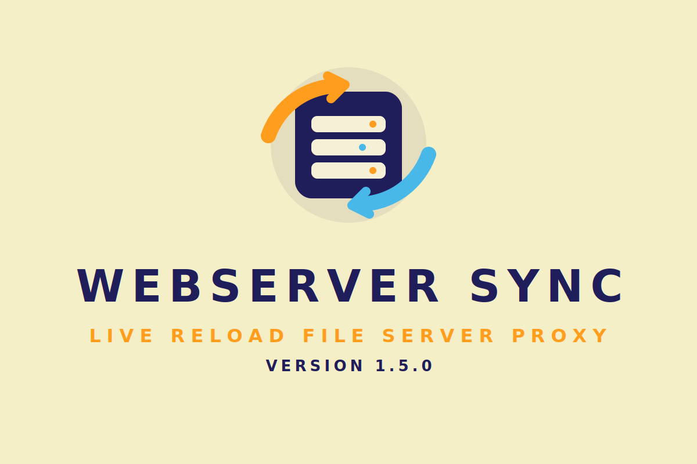

# WebServer SYNC 1.5.0: language and framework agnostic dev server


[](https://github.com/ArkansasIo/WebServer-SYNC-1.5.0/actions/workflows/ci.yml)
[](https://github.com/ArkansasIo/WebServer-SYNC-1.5.0/releases)
[](https://github.com/ArkansasIo/WebServer-SYNC-1.5.0)
[](https://github.com/ArkansasIo/WebServer-SYNC-1.5.0#readme)

WebServer SYNC 1.5.0 is a dev server featuring live-reloading, a file server, proxy support, and more.
It is language and framework agnostic, so it works for basically any web project.
Browser sessions can reload themselves (e.g. when a file changes) or show an overlay with a custom message (e.g. the compiler error).

WebServer SYNC 1.5.0 is available both as a command line application and as a library. The rest of this document will mainly talk about the CLI app.


## Example

<p align="center">
  </img>
</p>

- `webserver-sync-1-5-0 serve .` serves the current directory as file server
- `webserver-sync-1-5-0 proxy localhost:3000` forwards all requests to `http://localhost:3000`.
- `-m uri_path:fs_path` allows you to mount additional directories in the router.
- `webserver-sync-1-5-0 reload` reloads all active browser sessions.


## Installation

For now, install directly from this repository:

```
cargo install --git https://github.com/ArkansasIo/WebServer-SYNC-1.5.0 --path app
```

The installed binary is `webserver-sync-1-5-0`.


## CLI Usage

There are two main "entry points": `webserver-sync-1-5-0 proxy <target>` and `webserver-sync-1-5-0 serve <directory>`.
The `proxy` subcommand is useful if you have some (backend) webserver on your own, e.g. to provide an API.
The `serve` subcommand is useful if you only have static files that need to be served, e.g. for static site generators or backend-less single page applications.

In either case, you can *mount* additional directories at an URL path with `-m/--mount`.
The syntax is `-m <url-path>:<fs-path>`, for example `-m fonts:frontend/static`.
An HTTP request for `/fonts/foo.woff2` would be answered with the file `frontend/static/foo.woff2` or with 404 if said file does not exist.

All paths that are served by WebServer SYNC 1.5.0 are automatically watched by default.
This means that any file change in any of those directories will lead to all browser sessions reloading automatically.
You can watch additional paths (that are not mounted/served) with `-w/--watch`.

Reloading all active browser sessions can also be done manually via `webserver-sync-1-5-0 reload`.
This is intended to be used at the end of your build scripts.
Note that WebServer SYNC 1.5.0 is not a build system or task executor!
So you are mostly expected to combine it with other tools, like [`watchexec`](https://github.com/watchexec/watchexec), [`cargo watch`](https://github.com/passcod/cargo-watch) or others.
I am also working on [`floof`](https://github.com/LukasKalbertodt/floof/), which is a WIP file-watcher and task-runner/build-system that uses WebServer SYNC 1.5.0 under the hood to provide a dev server.

If you want a free domain-like hostname for testing on other devices, bind WebServer SYNC 1.5.0 to your LAN interface and use `--public-host` with a wildcard DNS provider such as `sslip.io`, `nip.io`, or `lvh.me`. Example:

```text
webserver-sync-1-5-0 serve . --bind 0.0.0.0 --public-host 192-168-1-23.sslip.io:4090
```

With `--public-host`, WebServer SYNC 1.5.0 uses that hostname in printed URLs, `--open`, and proxy redirect rewriting.

### Mobile control interface (Android + iPad/iOS 15+)

Open the control panel in any modern mobile browser:

```text
http://<host>:<port>/~~penguin/panel
```

This interface lets you:

- reload all connected browser sessions,
- send or clear overlay messages,
- view live server status and mounted routes,
- stop the running server with a shutdown action.

To start the server again after shutdown, run:

```text
webserver-sync-1-5-0 serve .
```

### App API

The control path also exposes a JSON API that can be used by Android/iOS apps
or any HTTP client:

- `GET /~~penguin/api/v1` → API info
- `GET /~~penguin/api/v1/status` → server status/config summary
- `POST /~~penguin/api/v1/reload` → reload all browser sessions
- `POST /~~penguin/api/v1/message` → send overlay message (UTF-8 text body)
- `POST /~~penguin/api/v1/shutdown` → stop server

Example:

```text
curl -X POST http://127.0.0.1:4090/~~penguin/api/v1/reload
```

Mobile install/output system files:

- Android: [output/android/INSTALL.md](output/android/INSTALL.md)
- Android API config template: [output/android/api-config.example.json](output/android/api-config.example.json)
- iPhone/iPad: [output/iphone/INSTALL.md](output/iphone/INSTALL.md)
- iPhone/iPad API config template: [output/iphone/api-config.example.json](output/iphone/api-config.example.json)

WebServer SYNC 1.5.0 output can be modified with `-v/-vv` and the log level (set via `-l` or `RUST_LOG`).

For the full CLI documentation run `webserver-sync-1-5-0 --help` or `webserver-sync-1-5-0 <subcommand> --help`.


## Project status and "using in production"

This project is fairly young and not well tested.
However, it already serves as a useful development tool for me.
I'm interested in making it useful for as many people as possible without increasing the project's scope too much.

I am looking for **Community Feedback**: please speak your mind in [this issue](https://github.com/ArkansasIo/WebServer-SYNC-1.5.0/issues/6).
Especially if you have a use case that is not yet well served by WebServer SYNC 1.5.0, I'd like to know about that!

"Can I use WebServer SYNC 1.5.0 in production?". **No, absolutely not!** This is a
development tool only and you should not open up a WebServer SYNC 1.5.0 server to the public.
There are probably a gazillion attack vectors.


## Versioning and stability guarantees

The app and library are versioned independently from one another. The project
mostly follows the usual semantic versioning guidelines.

- The required Rust version (MSRV) can be bumped at any time, even with minor
  releases. This will change once this project reaches 1.0.
- All UI (HTML/CSS) this app/lib produces is subject to change even with minor
  version bumps. For example, you cannot rely on a specific "directory listing"
  of the file server.
- HTTP headers in server replies might be added (or potentially even removed)
  even in minor version bumps.


<br />

---

## License

Licensed under either of <a href="LICENSE-APACHE">Apache License, Version
2.0</a> or <a href="LICENSE-MIT">MIT license</a> at your option.
Unless you explicitly state otherwise, any contribution intentionally submitted
for inclusion in this project by you, as defined in the Apache-2.0 license,
shall be dual licensed as above, without any additional terms or conditions.
